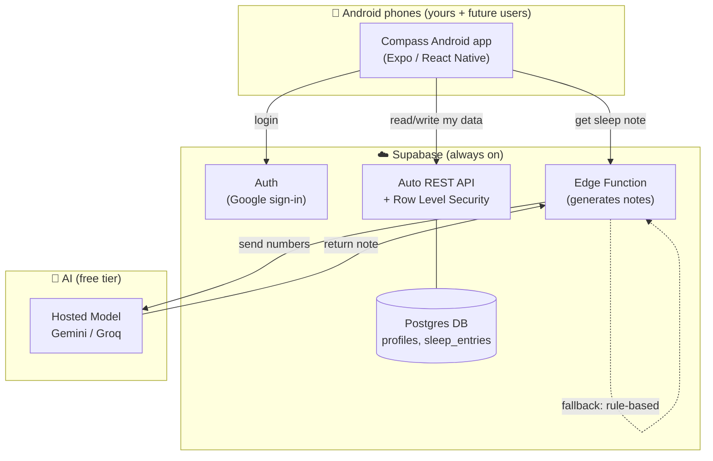
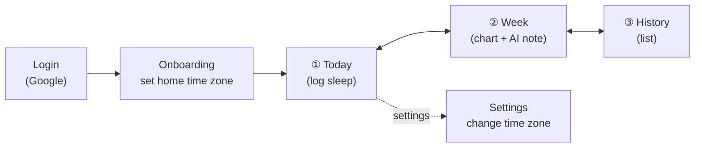
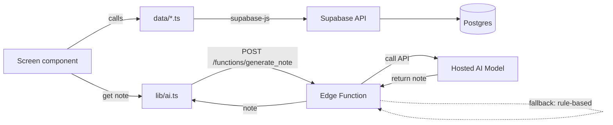
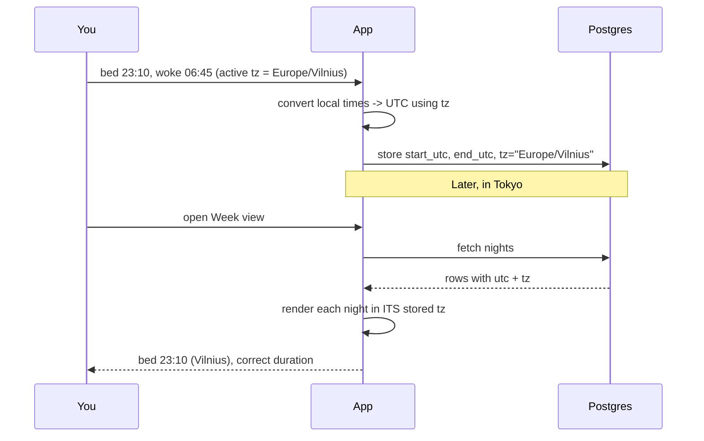
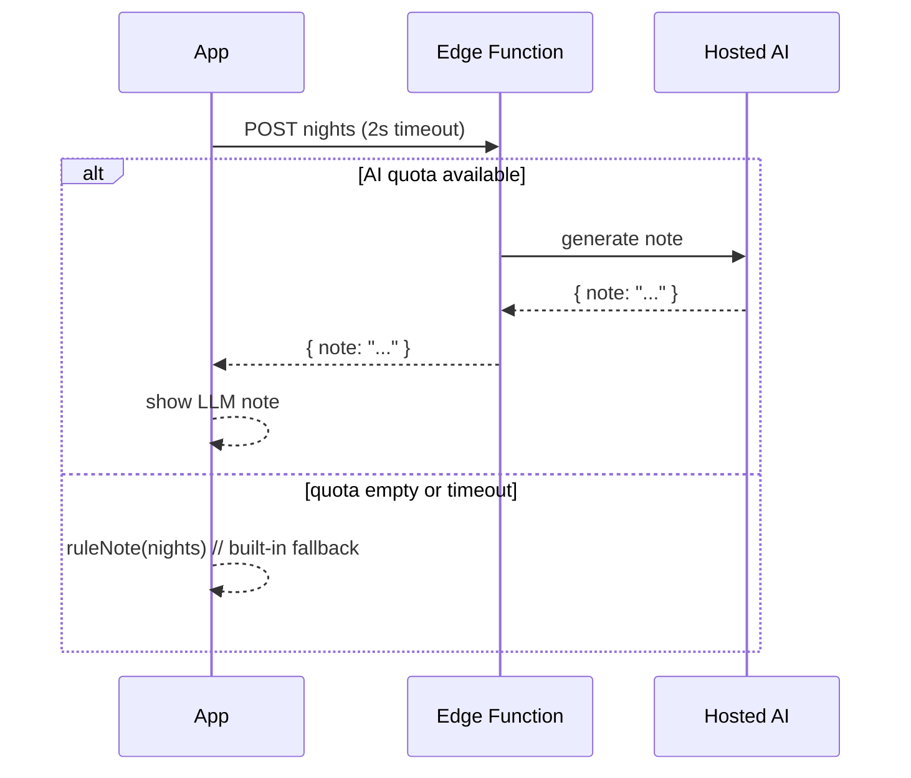
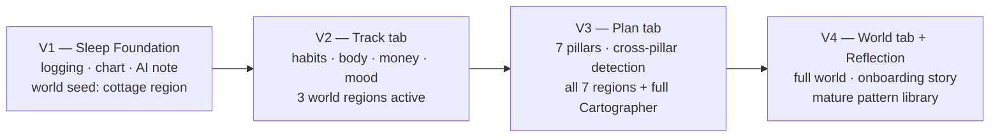

# Compass — V1 Design (Sleep Log + AI Note)

> A private personal navigation app. This document covers **only V1**: a calm sleep
> tracker with a gentle AI-written note, Google login, and correct time-zone handling.
> Everything is designed so V2 (energy, mood, qualities) and V3 (chat, planning) can be
> added later without rebuilding.

---

## 0. TL;DR — what you'll build and run

| Concern | Choice for V1 | Why |
|---|---|---|
| Where it runs | **Android app** (Expo React Native, installable now and publishable to Google Play later) | Matches your goal: real install flow today and Play Store-ready path |
| Frontend | **Expo + React Native + TypeScript** | You already have this in the repo (`mobile/`), one codebase for Android now and iOS later |
| Login | **Google sign-in via Supabase Auth** | Free, others can sign up, you write almost no auth code |
| Database + API | **Supabase (hosted Postgres)** free tier | Auto-generated secure API, each user only sees their own rows |
| AI note | **AI from day one** — cloud Edge Function calling free hosted model (Gemini / Groq), with rule-based fallback | Free tier with privacy choice; gentle note is core product from day one, not an afterthought |
| Cost | **£0 / month** | Free tiers + free-tier AI models |

The plan keeps **everything in a single free platform** (Supabase) so friends can use the app any time. The **AI is in the cloud** (free hosted model via Edge Function), which means:
- ✅ Nothing to run at home
- ✅ One platform to maintain
- ✅ Choose privacy mode if needed (Mode 2: local private AI)

---

## 1. The one big architecture decision (read this)

You said two things that slightly pull in opposite directions:

1. *"Maybe better to have it locally so I don't pay for anything."*
2. *"I'd love this app to be used by other people — Google auth."*

**Simplified:** Everything lives in the cloud (Supabase). This means:
- ✅ Always on — friends can log in anytime
- ✅ Nothing running at home — no tunnel, no laptop uptime requirement
- ✅ Still free — uses free-tier AI hosted models
- ✅ Privacy option — if you want zero external AI calls, Mode 2 runs local AI server

This gives you a free, shareable app with simple maintenance.



> **Privacy modes:** Mode 1 (above) uses free hosted AI. Mode 2 lets you run local private AI on your laptop—see architecture.html § 03b.

---

## 2. Scope of V1 (kept deliberately small)

**In V1:**
- Google login.
- Timezone **auto-detected from the device** (IANA) — no setup screen required; editable in Settings.
- Log a night's sleep: **went to bed** time + **woke up** time.
- See your sleep as a **bar chart** for the last 7 days.
- See a short **AI note** under the chart (e.g. wake time, bedtime, total, one gentle line).
- A plain **history list** of past nights.
- Shift time zone when travelling (so hours stay accurate).

**Not in V1** (comes later): energy, mood, qualities, values, planning, chat, Kanban.

> Your written roadmap lists energy + mood inside V1. Your message asked to *start with
> just sleep*. I've scoped the first build to **sleep only**, but the database and screens
> are designed so energy + mood drop in with almost no rework (see §6 notes).

---

## 3. Screens & navigation (V1)

Three tabs, bottom nav, calm and uncluttered.



### Wireframe — ① Today (log a night's sleep)

```
┌──────────────────────────────┐
│  Compass               ⚙︎     │   ← settings (time zone)
├──────────────────────────────┤
│  Tuesday, 10 June            │
│  🌍 Europe/Vilnius (home)    │   ← active time zone, tap to shift
│                              │
│  How did you sleep?          │
│                              │
│   Went to bed                │
│   ┌────────────┐             │
│   │  23:10  ▾  │  ⟲ yesterday│
│   └────────────┘             │
│                              │
│   Woke up                    │
│   ┌────────────┐             │
│   │  06:45  ▾  │  ⟲ today    │
│   └────────────┘             │
│                              │
│   = 7h 35m                   │   ← live duration
│                              │
│   ┌────────────────────────┐ │
│   │      Save night        │ │
│   └────────────────────────┘ │
├──────────────────────────────┤
│  ●Today    Week    History   │   ← bottom tabs
└──────────────────────────────┘
```

### Wireframe — ② Week (chart + AI note)

```
┌──────────────────────────────┐
│  This week                   │
│  Avg sleep: 6h 52m           │
│                              │
│  9h ┤                        │
│  7h ┤ ▆   ▆ ▇   ▆ ▇ ▅        │   ← 7-day bar chart
│  5h ┤ █ ▄ █ █ ▃ █ █          │
│  3h ┤ █ █ █ █ █ █ █          │
│     └ M T W T F S S          │
│                              │
│  ┌──────────────────────────┐│
│  │ 🤖 Note                   ││
│  │ You averaged 6h 52m this  ││
│  │ week. Your latest night   ││
│  │ was 7h 35m (bed 23:10,    ││
│  │ woke 06:45). Your longer  ││
│  │ nights cluster on the     ││
│  │ weekend — gentle, no need ││
│  │ to change anything yet.   ││
│  └──────────────────────────┘│
├──────────────────────────────┤
│  Today    ●Week    History   │
└──────────────────────────────┘
```

### Wireframe — ③ History (plain list)

```
┌──────────────────────────────┐
│  History                     │
├──────────────────────────────┤
│  Today      7h35  bed 23:10 ›│
│  Yesterday  6h15  bed 00:05 ›│
│  Sun        7h20  bed 22:40 ›│
│  Sat        8h05  bed 23:30 ›│
│  Fri        5h40  bed 01:10 ›│
│  Thu        6h50  bed 23:55 ›│
│  Wed        7h10  bed 23:20 ›│
│  …                           │
├──────────────────────────────┤
│  Today    Week    ●History   │
└──────────────────────────────┘
```

---

## 4. Component structure (frontend)

```
src/
  App.tsx                  # app entry + tab shell
  index.ts                 # Expo bootstrap
  lib/
    supabase.ts            # Supabase client (URL + anon key)
    time.ts                # time-zone & duration helpers (the careful bit)
    ai.ts                  # calls Supabase Edge Function for note generation
  auth/
    AuthGate.tsx           # shows Login until signed in, then the app
    LoginScreen.tsx        # "Continue with Google" button
  features/
    today/
      TodayScreen.tsx      # the log form
      SleepForm.tsx        # bed/wake time pickers + live duration
    week/
      WeekScreen.tsx       # chart + AI note card
      SleepBarChart.tsx
      AiNoteCard.tsx
    history/
      HistoryScreen.tsx
    settings/
      SettingsScreen.tsx   # change active time zone
  data/
    sleep.ts               # read/write sleep_entries via Supabase
    profile.ts             # read/write profile (home + active time zone)
  components/
    BottomTabs.tsx
    TimePicker.tsx
```

**Data flow (one direction, easy to reason about):**



---

## 5. Time-zone handling (the part that must be right)

**Rule of thumb: store everything in UTC, remember which zone it was logged in, and
display it back in that zone.** This keeps hours accurate even when you travel or DST changes.

- Your **home time zone** (IANA) is **auto-detected from the device** on first launch — no setup screen required.
- The app keeps an **active time zone** in your profile. It defaults to the detected home zone.
- When you travel, open Settings and switch the active zone (e.g. to `Asia/Tokyo`).
  You keep logging normally; new nights are stamped with the new zone.
- Each saved night stores:
  - `sleep_start_utc`, `sleep_end_utc` — absolute instants in **UTC**.
  - `tz` — the IANA zone that was active when you logged it.
- **Duration** = `end_utc − start_utc`. It's an absolute difference, so it's always
  correct regardless of zone or DST.
- **Display**: each night is shown converted into **its own stored `tz`**, so "bed 23:10"
  still means 23:10 local-at-the-time — not shifted by later travel.



> Use the browser's built-in `Intl.DateTimeFormat` / `Temporal` (or a tiny lib like
> `date-fns-tz`) for the conversions in `lib/time.ts`. Never store "23:10" as a bare
> string — always UTC + zone.

---

## 6. Database schema (Supabase / Postgres)

Supabase already gives you an `auth.users` table for login. You add two tables.

```mermaid
erDiagram
    USERS ||--|| PROFILES : has
    USERS ||--o{ SLEEP_ENTRIES : logs

    USERS {
        uuid id PK
        text email
    }
    PROFILES {
        uuid user_id PK_FK
        text display_name
        text home_tz "IANA, set once"
        text active_tz "IANA, changes when travelling"
        timestamptz created_at
    }
    SLEEP_ENTRIES {
        uuid id PK
        uuid user_id FK
        timestamptz sleep_start_utc
        timestamptz sleep_end_utc
        text tz "IANA at time of logging"
        timestamptz created_at
        smallint energy "nullable - for V2"
        smallint mood "nullable - for V2"
    }
```

`energy` and `mood` are added now as **nullable** columns so V2 needs no migration —
V1 simply ignores them.

**SQL to create the tables (run in Supabase SQL editor):**

```sql
create table profiles (
  user_id     uuid primary key references auth.users(id) on delete cascade,
  display_name text,
  home_tz     text not null,
  active_tz   text not null,
  created_at  timestamptz not null default now()
);

create table sleep_entries (
  id              uuid primary key default gen_random_uuid(),
  user_id         uuid not null references auth.users(id) on delete cascade,
  sleep_start_utc timestamptz not null,
  sleep_end_utc   timestamptz not null,
  tz              text not null,
  energy          smallint,   -- V2 (nullable now)
  mood            smallint,   -- V2 (nullable now)
  created_at      timestamptz not null default now(),
  check (sleep_end_utc > sleep_start_utc)
);

create index sleep_entries_user_start_idx
  on sleep_entries (user_id, sleep_start_utc desc);
```

**Row Level Security — this is what makes "each user sees only their own data" true:**

```sql
alter table profiles      enable row level security;
alter table sleep_entries enable row level security;

create policy "own profile"
  on profiles for all
  using (auth.uid() = user_id)
  with check (auth.uid() = user_id);

create policy "own sleep"
  on sleep_entries for all
  using (auth.uid() = user_id)
  with check (auth.uid() = user_id);
```

With RLS on, even though everyone hits the same API, the database refuses to return
another person's rows. You don't have to write that check in your app code.

---

## 7. API (you mostly get this for free)

With Supabase you usually **don't hand-write API endpoints** — `supabase-js` talks to the
auto-generated REST API, and RLS keeps it safe. Conceptually the operations are:

| Action | Operation (via supabase-js) | Notes |
|---|---|---|
| Sign in | `supabase.auth.signInWithOAuth({ provider: 'google' })` | Opens Google consent |
| Get my profile | `select * from profiles where user_id = me` | RLS enforces "me" |
| Set home/active tz | `upsert profiles` | Auto-detected on first launch · editable in Settings |
| Save a night | `insert into sleep_entries (...)` | Times already converted to UTC |
| Last 7 days | `select ... order by sleep_start_utc desc limit 7` | Feeds chart + note |
| Full history | `select ... order by sleep_start_utc desc` | Paginated list |

The **only** custom endpoint is the AI note, which runs as a **Supabase Edge Function**:

```
POST  https://<project-id>.supabase.co/functions/v1/generate-note
body  { "nights": [ {start_utc, end_utc, tz, duration_minutes}, ... ], "user_id": "..." }
resp  { "note": "You averaged 6h 52m this week ..." }
```

`lib/ai.ts` calls this; if it fails or times out, it falls back to `ruleNote()`
locally and the user never sees an error.



---

## 8. The AI note (free) — from day one

The gentle note ships **in the very first release**. It is never a "phase 2" feature.
There are two layers; the app always shows a note, no matter what.

**Layer 1 — cloud LLM (the day-one default):**
1. Create a Supabase Edge Function at `functions/generate-note.ts` that calls a **free hosted AI model** (Gemini / Groq).
2. The function takes your week's sleep numbers, calls the hosted model with a simple prompt, and returns 2–3 calm sentences.
3. The AI never sees your name, email, or login — only the numbers.

**Layer 2 — rule-based fallback (always present, invisible):**
A small deterministic function in `lib/ai.ts` builds a sentence from the numbers
(average sleep, latest night's bedtime/wake/duration, one gentle observation).
It runs instantly and offline. The app calls the Edge Function first with a short timeout; if it fails or the quota is empty, it quietly uses this instead. The user never sees an error and
never sees an "AI is unavailable" state — there is always a note.

> This is what "AI from day one" means in practice: the intelligent note is core, but it
> degrades gracefully to a still-useful rule-based line so the product is never broken.

**Prompt guardrails** (so it stays calm and non-judgmental, matching your vision):
- Never say "you failed" / "you should". Only gentle observation + optional tiny suggestion.
- Keep to 2–3 sentences.
- Always include the concrete numbers (so it's grounded, not vague).
- Frame patterns as hypotheses ("possible pattern", "worth watching") — never as facts.

---

## 9. Build order (small, safe steps)

1. **Hello Android app**: Expo app runs on your phone with Expo Go / dev build.
2. **Login**: wire Supabase Google auth; show a signed-in screen.
3. **Onboarding**: set `home_tz`, save profile.
4. **Log sleep**: Today screen → save to `sleep_entries` (UTC + tz).
5. **AI note, both layers**: ship `ruleNote()` *and* the Edge Function `generate-note`
   together, with the timeout-and-fallback wiring. AI is live from this step on.
6. **History**: list past nights in their stored tz.
7. **Week**: bar chart of last 7 nights + average, with the AI note card on top.
8. **Travel**: Settings screen to change `active_tz`.
9. **Release path**: create `aab` with EAS Build → internal test track → production in Google Play.

Operational checklist for this release flow lives in: `mobile/PLAY_STORE_RELEASE_CHECKLIST.md`.

> The Edge Function goes in at step 5, not at the end — that's the "AI from day one"
> commitment. The rule-based fallback is written in the same step so the note is always
> present, even before the Edge Function is deployed.

Each step is independently testable and leaves you with a working app.

---

## 9b. How the simple sleep app grows (without rebuilding)

V1 is deliberately tiny, but every choice is made so the full vision drops in without a rewrite. Growth is additive, never destructive. The World system — a living illustrated landscape that reflects real patterns in your data — is woven through all four versions, growing naturally as the user logs more.



### Version scope

| Version | Product scope | World scope | Cartographer |
|---|---|---|---|
| **V1** | Sleep logging, bar chart, AI note, target strip, history | Cottage region only. "A scene has appeared" card after 3 logs. World otherwise unmapped and visibly empty. | Exists but silent. Walks past once. Never speaks. |
| **V2** | Track tab (Sleep / Habits / Body / Money), energy & mood, habit tracking | 3 regions: Cottage + Grove + River. Weather system (emotional state) active. | Appears after first cross-pillar pattern confirmed. Up to 3 scene types. |
| **V3** | Plan tab (Year / Month / Projects / Map), 7 pillars, Margulan month flow, onboarding story with dial | All 7 regions. Lighthouse navigable. Cross-pillar dependency detection fully active. | Full margin-note library. Map room accessible. |
| **V4** | Dedicated World tab, Chat as Cartographer's journal, mature pattern detection, world personalisation | Full scene library. Contribution nourishing/draining mature. World reflects now, not past glory. | Fully active. Asks one question only. Never lectures. |

### What V1 builds and what it grows into

| What V1 builds | What it grows into | Why no rebuild |
|---|---|---|
| `sleep_entries` with nullable `energy`, `mood` | Track → Sleep / Body sub-views | Columns already exist; just surface them |
| Bottom-tab shell (Today / Week / History) | 5-tab shell (Chat / Today / Plan / Track / World) | Tabs are data-driven; add entries, don't restructure |
| `lib/ai.ts` note (LLM + fallback) | Every future insight across all pillars and trackers | One AI seam reused everywhere; same guardrails apply |
| One `entries` pattern + RLS | New tables (habits, money, cards, scenes) follow same shape | Same per-user RLS recipe copied per table |
| "Possible pattern" insight card | Pattern detection → scene discovery → World growth | The hypothesis framing is baked in from day one |
| Observation line under each sleep entry | Same observation layer in every tracking area | Same pattern; different domain |

**Three rules that protect future growth:**
1. **One AI seam.** All notes go through `lib/ai.ts` (LLM first, rule-based fallback). New trackers reuse it — never bolt AI on twice.
2. **Pillars are data, not layout.** Life pillars (Health / Inner / Money / Family / Joy / Contribution / Admin) become a colour + filter field on cards — exactly as in [future-design/plan-tab.html](future-design/plan-tab.html). Never hardcoded layout.
3. **Additive schema only.** New features add nullable columns or new tables; they never change or drop what V1 wrote.

> Keep V1 boring on purpose. The job of the first release is to make the daily logging habit stick and prove the AI-note seam. The World grows naturally from real data — it cannot be rushed and should not be faked.

---

## 10. Naming

The detailed roadmap calls it **North Star**; your workspace has a **Compass** folder.
Both fit the "direction-shower / life supporter" idea. Pick one and keep it — this doc
uses **North Star** as the working title. Easy to change later (it's just a string).

---

## 11. What you owe nobody money for

- Supabase free tier: auth + Postgres + API.
- Cloudflare Tunnel: free public URL to your laptop.
- Ollama + open model: free local AI.
- Expo + EAS (starter usage): free to build and test Android packages.
- Note for launch: Google Play Console requires a **one-time** developer fee (~$25).
- Total while building: **£0/month**, fully shareable, AI stays private on your machine.

---

## 12. The World system

Compass is not just a tracker. It is a **living inner world** that reflects the user's real patterns as they emerge from data. Every region is unmapped until the data confirms something real. The world cannot be rushed and should never be faked.

### Two parallel layers

| Layer | What it is | Where it lives |
|---|---|---|
| **Data layer** | Raw logs, times, notes, scores | Track / Plan / History screens |
| **World layer** | Visual expression of confirmed patterns | World screen + scene cards in Today |

The world layer never invents. It only reflects what the data layer has confirmed.

### The 4 energy types

Energy is not a tab or a view. It is the invisible interpretation engine that reads all tracking data. The Track tab stays as Sleep / Habits / Body / Money — energy is the layer above that reads all of them and translates them into world state.

| Energy type | What it measures | Primary app sources | World expression |
|---|---|---|---|
| **Physical** | Body power, sleep, recovery, movement | Track → Sleep, Track → Body | Cottage light, road firmness, weather clarity |
| **Mental** | Focus, decisions, cognitive load, open loops | Track → Habits, Plan open tasks | Library lamps, map clarity, fog density |
| **Emotional** | Mood, patience, warmth, relational quality | Mood notes, Family pillar | Hearth brightness, river flow, garden colour |
| **Spiritual** | Purpose, meaning, alignment, service | Contribution pillar, Inner reflection | Stars, lighthouse visibility, horizon clarity |

**Hierarchy:** Physical is the ground. Without it, the other three become fragile. The app understands this — it will not surface spiritual observations when physical energy is critically low.

### The 7 world regions

Each life pillar = one region. Regions start unmapped and grow as real data accumulates.

| Pillar | World region | Visual elements | Fed by |
|---|---|---|---|
| **Health / Body** | Moonlit cottage, garden, well, path | Cottage light, garden bloom, well water level | Sleep + Body tracking |
| **Inner / Mind** | Still grove, small lake, quiet room | Water disturbance, leaf stillness, light quality | Mood notes, reflection logs, patience practice |
| **Money / Capital** | Quiet market, treasury, stone bridge | Market activity level, bridge open/closed, treasury lamp | Money tracking, plan goals |
| **Family / Relationships** | Hearth house, long table, lantern path | Hearth warmth, lanterns lit, path visibility | Family logs, relational quality notes |
| **Joy / Beauty** | River, open water, mountain path | River movement, path openness, light on water | Joy events, beauty moments, experiences |
| **Contribution / Service** | Town square, workshop, bridge to others | Square presence, bridge strength, workshop light | Contribution acts + nourishing/draining signal |
| **Plan / Navigation** | Lighthouse, map room, compass tower, roads | Lighthouse visibility, road condition, map clarity | Open loops, goal completion, admin clarity |

### Energy as world atmosphere

The world never shows numbers. It shows state. Energy appears as light, weather, water, road condition, and sky.

| Energy state | World condition |
|---|---|
| Physical high | Clear sky, firm road, cottage warmly lit |
| Physical low | Heavy weather, soft ground, dim cottage |
| Mental high | Map clear, lighthouse visible, library bright |
| Mental low | Fog near library, map obscured, unclear roads |
| Emotional high | Hearth warm, river flowing, garden in colour |
| Emotional low | Hearth dim, river still, garden grey |
| Spiritual high | Stars visible, horizon open, lighthouse beam reaches far |
| Spiritual low | Overcast, horizon hidden, lighthouse dim |

### Observation system — per tracking area

Every tracking area has its own quiet observation layer. Sleep already has this (the italic lines under each history entry). The same pattern extends to all areas as they are built.

| Area | Example observation | Cross-pillar signal emitted |
|---|---|---|
| Sleep | *"bedtime shifted · shorter night"* | Physical energy level, impulse control signal |
| Body | *"lower movement · tension noted"* | Physical recovery rate, mental reset capacity |
| Habits | *"food planned · decision load lighter"* | Mental energy, impulse signal |
| Money | *"purchase deferred · unclear day"* | Emotional + mental energy state |
| Plan | *"three threads unresolved this week"* | Mental load signal, sleep interference risk |
| Inner | *"quieter than the previous week"* | Emotional energy, family quality signal |
| Family | *"the hearth was easier to sit beside"* | Emotional energy restoration signal |
| Joy | *"something entered the day before evening"* | Emotional recharge, mental fog reduction |
| Contribution | *"the traveller stayed only as long as the light remained"* | Spiritual energy, emotional signal |

### Scene discovery — confidence thresholds

Scenes are earned by data, not scheduled. The Cartographer's certainty scales with data volume.

| Scene type | Trigger condition | Cartographer tone |
|---|---|---|
| Single-area observation | 3+ logs in one area show a direction | Tentative — soft, open language |
| Single-area pattern | 7+ logs confirm consistent signal | Observational — stated as world fact |
| Cross-pillar correlation | 2 areas both logged ≥5 times, pattern detectable | Named — connection shown |
| Cross-pillar confirmation | 10+ logs per area, holds over 2+ weeks | Confirmed — written in the map margin |

**Delivery rules:** Maximum one scene per 48 hours. Scenes queue and never expire, but arrive one at a time. No scene on day 1. One button only: "Continue" or "Return."

### Cross-pillar dependency web

The app detects these connections from real data — never assumes them in advance.

| Cause | Effect | Detectable after |
|---|---|---|
| Sleep duration low | Money impulse signals increase | 5 sleep + 3 money logs |
| Sleep consistent | Plan execution rate improves | 7 sleep + plan activity |
| Sleep low | Habit completion drops | 5 sleep + habit logs |
| Sleep low | Family / emotional quality drops | 5 sleep + mood notes |
| Body movement logged | Sleep onset improves | 5 body + 7 sleep logs |
| Body movement logged | Mental fog reduces next day | 5 body + habit / plan logs |
| Habits complete (food) | Money impulse reduces | 7 habit + 5 money logs |
| Open plan loops | Sleep quality drops (rumination) | 5 open-loop weeks + sleep |
| Money unresolved | Plan blocked / stalled | Plan + money logs |
| Money unresolved | Sleep disrupted (financial anxiety) | 5 money concern + sleep |
| Inner reflection logged | Plan decisions improve | 5 inner + plan logs |
| Family draining | Emotional energy depletes | 5 family quality logs |
| Family draining | Sleep disrupted (unresolved conflict) | Family + sleep logs |
| Joy event logged | Mental fog reduces next day | 3 joy + habit / plan logs |
| Contribution (nourishing) | Spiritual / purpose signal rises | 5 contribution + inner logs |
| Contribution (draining) | Emotional depletion visible | 5 contribution logs with signal |

### The contribution detection problem

Nourishing giving and obligation giving look identical from outside. After every contribution log, one question: *"Did that restore you or cost you?"* (two taps, no text required). The Cartographer tracks the ratio over time and can then distinguish the two.

### Hard rules

| Rule | Reason |
|---|---|
| World never fills faster than data confirms | Trust — the user knows what they logged |
| No scene on day 1 | Earned, not given |
| No cross-pillar scene without both streams logged | Never invent a connection the data doesn't confirm |
| Unmapped regions stay visibly empty | Honest emptiness creates pull — the user wants to map more |
| Patterns disappear if data stops | The world is alive — it reflects now, not past glory |
| One scene per 48 hours maximum | Scarcity preserves meaning |
| Contribution always asks nourishing/draining | The only area where the signal can silently invert |

---

## 13. The Cartographer

**Who:** A small, precise figure with a coat and a notebook. Moves through the world. Always looking at something — never at the user. The name fits: a Cartographer makes maps. The user's life is the territory. The app draws the map as they live.

**Role:** *"I found this in your world. Look."* — never *"Here is what you should do."*

### When it appears
- A scene has generated (data threshold met)
- A cross-pillar pattern has confirmed
- A region has grown or changed significantly

### When it stays silent
- Fewer than 3 logs in any area
- Data insufficient to confirm a pattern
- A scene was already shown within 48 hours

### Voice rules

Past tense. Third-person about the world. Maximum 2 sentences per scene. Never "you."

| ✓ Correct | ✗ Never |
|---|---|
| *"The cottage was warmer after the third steady night."* | *"You slept better this week — great progress!"* |
| *"The market quieted. Nothing was decided from urgency."* | *"Your spending improved because of better sleep."* |
| *"The water in the grove was less disturbed than before."* | *"Try going to bed earlier tonight."* |
| *"The lighthouse was visible again. Not closer — just no longer hidden."* | *"You're on a 5-day streak!"* |

### What the Cartographer never does
- Says "you should"
- Cheers, congratulates, or scolds
- Shows percentage scores for energy levels
- Shows streak counters or reward badges
- Appears uninvited more than once per 48 hours
- Speaks when data is insufficient to confirm a pattern
```
